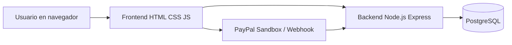
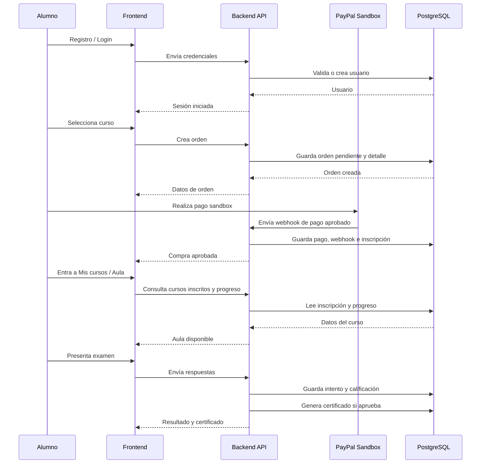

# Arquitectura de la Solución - EduTech

## Proyecto

EduTech - Plataforma web para venta y consumo de cursos en línea.

## Tipo de arquitectura

Para esta entrega, EduTech usa una arquitectura web por capas, organizada como una aplicación frontend + API backend + base de datos relacional.

No se implementan microservicios. El sistema funciona como una API monolítica modular, separada internamente por rutas, controladores y servicios.

---

## Vista general



---

## Capas del sistema

| Capa | Tecnología | Responsabilidad |
|---|---|---|
| Presentación | HTML, CSS y JavaScript | Mostrar pantallas, formularios, carrito, aula, examen, certificado y paneles. |
| API / Backend | Node.js con Express | Procesar reglas de negocio, autenticación, roles, cursos, compras, pagos, progreso, exámenes y certificados. |
| Base de datos | PostgreSQL | Guardar información persistente del sistema. |
| Pagos | PayPal Sandbox / simulación sandbox | Simular y confirmar pagos mediante flujo de pago y webhook. |
| Contenedores | Docker Compose | Levantar PostgreSQL y cargar scripts SQL iniciales. |
| Configuración | dotenv y .env | Separar credenciales y variables de entorno del código fuente. |

---

## Organización del backend

El backend se organiza usando una variante simple del patrón MVC:

```txt
backend/
├── src/
│   ├── app.js
│   ├── server.js
│   ├── config/
│   ├── controllers/
│   ├── routes/
│   ├── services/
│   └── db/
├── sql/
├── package.json
└── env.example
```

### Rutas

Las rutas reciben las peticiones HTTP y las conectan con el controlador correspondiente.

Ejemplos:

- `auth.routes.js`
- `cursos.routes.js`
- `ordenes.routes.js`
- `misCursos.routes.js`
- `paypal.routes.js`
- `examenes.routes.js`
- `instructores.routes.js`
- `admin.routes.js`

### Controladores

Los controladores contienen la lógica de cada módulo y responden al frontend.

Ejemplos:

- `auth.controller.js`
- `cursos.controller.js`
- `ordenes.controller.js`
- `misCursos.controller.js`
- `paypal.controller.js`
- `examenes.controller.js`
- `admin.controller.js`

### Servicios

Los servicios se usan para funciones reutilizables o reglas específicas.

Ejemplo:

- `certificados.service.js`: genera o consulta certificados cuando un alumno aprueba el examen.

---

## Organización del frontend

```txt
frontend/
├── index.html
├── cursos.html
├── detalle-curso.html
├── comprar-curso.html
├── pago-sandbox.html
├── compra-aprobada.html
├── mis-cursos.html
├── aula.html
├── examen.html
├── certificado.html
├── instructor.html
├── instructor-examen.html
├── admin.html
├── css/
└── js/
```

### Responsabilidades del frontend

- Mostrar las pantallas del sistema.
- Consumir la API mediante `fetch`.
- Guardar sesión temporal del usuario en el navegador.
- Proteger pantallas desde el lado visual con guardias de sesión y rol.
- Mostrar datos dinámicos: cursos, progreso, examen, certificado y paneles.

---

## Base de datos

La base de datos se construye en PostgreSQL mediante scripts SQL.

```txt
database/sql/
├── 01_ddl_edutech.sql
├── 02_dml_edutech.sql
├── 03_dcl_edutech.sql
├── 03_dml_examenes_demo.sql
└── 04_dml_certificados_aprobados.sql
```

### Scripts principales

| Script | Uso |
|---|---|
| `01_ddl_edutech.sql` | Crea esquemas, tablas, llaves primarias, llaves foráneas y restricciones. |
| `02_dml_edutech.sql` | Inserta datos base: roles, estados, usuarios demo, cursos, módulos y lecciones. |
| `03_dcl_edutech.sql` | Configura permisos de base de datos. |
| `03_dml_examenes_demo.sql` | Inserta exámenes demo y preguntas. |
| `04_dml_certificados_aprobados.sql` | Inserta certificados de ejemplo; se recomienda no usarlo para exposición si se desea demostrar la generación desde cero. |

---

## Flujo principal del sistema



---

## Seguridad aplicada

| Elemento | Medida |
|---|---|
| Contraseñas | Se guardan como `password_hash`, no en texto plano. |
| Variables privadas | Se guardan en `.env`, ignorado por Git. |
| Roles | Se separan Alumno, Instructor y Administrador. |
| Rutas protegidas | Se valida sesión y rol antes de mostrar funciones. |
| Compra | El curso se libera cuando el backend confirma pago, no solo por el navegador. |
| Webhook | Se registra el evento externo y se evita procesar duplicados. |

---

## Variables de entorno

El backend usa `.env` para configuración local:

```env
PORT=3000
DB_HOST=localhost
DB_PORT=5432
DB_NAME=bd_edutech
DB_USER=postgres
DB_PASSWORD=1234
JWT_SECRET=edutech_sprint2_clave_temporal_1234
```

El archivo real `.env` no debe subirse al repositorio. Solo debe subirse `backend/env.example` como plantilla.

---

## Justificación de la arquitectura

Esta arquitectura es adecuada para el proyecto porque:

1. Permite separar interfaz, lógica de negocio y datos.
2. Es sencilla de ejecutar en Codespaces.
3. Facilita probar backend y frontend por separado.
4. Permite usar PostgreSQL con Docker sin configuración local complicada.
5. Soporta los módulos principales: usuarios, cursos, compras, pagos, progreso, exámenes y certificados.
6. Es suficiente para una entrega académica sin aumentar la complejidad con microservicios.
