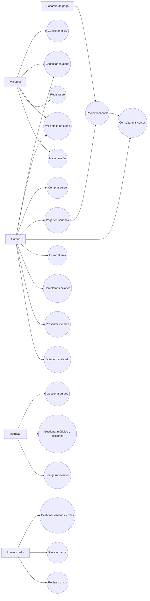

# Diagramas y Casos de Uso - EduTech

## Proyecto

EduTech - Plataforma web para venta y consumo de cursos en línea.

## Actores principales

| Actor | Descripción |
|---|---|
| Visitante | Usuario sin sesión que puede navegar por inicio, catálogo, detalle de curso, registro e inicio de sesión. |
| Alumno | Usuario registrado que compra cursos, accede al aula, marca lecciones, presenta examen y obtiene certificados. |
| Instructor | Usuario que administra cursos, módulos, lecciones y exámenes. |
| Administrador | Usuario que supervisa usuarios, cursos, pagos, solicitudes y roles. |
| Pasarela de pago | Sistema externo, como PayPal Sandbox, que procesa pagos y notifica al backend mediante webhook. |

---

# Diagrama general de casos de uso

---

# Casos de uso detallados

## CU-01. Registrarse como alumno

| Campo | Descripción |
|---|---|
| Actor principal | Visitante |
| Objetivo | Crear una cuenta de alumno. |
| Precondición | El visitante no debe tener sesión iniciada. |
| Flujo principal | 1. El visitante abre Registro. 2. Captura datos personales. 3. El sistema valida datos. 4. El sistema crea usuario con rol Alumno. 5. El sistema muestra confirmación o permite iniciar sesión. |
| Flujo alterno | Si el correo ya existe, el sistema muestra error y no registra. |
| Resultado | Usuario alumno creado en la base de datos. |

---

## CU-02. Iniciar sesión

| Campo | Descripción |
|---|---|
| Actor principal | Alumno, Instructor o Administrador |
| Objetivo | Entrar al sistema según el rol. |
| Precondición | El usuario debe estar registrado. |
| Flujo principal | 1. El usuario abre Login. 2. Captura correo y contraseña. 3. El backend valida credenciales. 4. El sistema guarda sesión. 5. El sistema redirige según rol. |
| Flujo alterno | Si los datos son incorrectos, se muestra error. |
| Resultado | Sesión iniciada y acceso a funciones del rol. |

---

## CU-03. Comprar curso

| Campo | Descripción |
|---|---|
| Actor principal | Alumno |
| Objetivo | Comprar uno o varios cursos. |
| Precondición | El alumno debe tener sesión iniciada. |
| Flujo principal | 1. El alumno consulta catálogo. 2. Abre detalle del curso. 3. Agrega curso al carrito. 4. Confirma datos de compra. 5. El sistema crea una orden pendiente. 6. El alumno continúa al pago sandbox. |
| Flujo alterno | Si el curso ya fue comprado, no se debe permitir comprarlo otra vez. |
| Resultado | Orden creada y lista para pago. |

---

## CU-04. Confirmar pago por webhook

| Campo | Descripción |
|---|---|
| Actor principal | Pasarela de pago |
| Objetivo | Confirmar al backend que el pago fue aprobado. |
| Precondición | Debe existir una orden pendiente. |
| Flujo principal | 1. La pasarela procesa el pago. 2. Envía evento al webhook del backend. 3. El backend valida orden, evento y monto. 4. Registra el pago. 5. Guarda el webhook. 6. Cambia la orden a completada. 7. Crea inscripción para el alumno. |
| Flujo alterno | Si el evento ya fue procesado, el sistema evita duplicados. |
| Resultado | Curso liberado en Mis cursos. |

---

## CU-05. Acceder al aula

| Campo | Descripción |
|---|---|
| Actor principal | Alumno |
| Objetivo | Consultar el contenido de un curso comprado. |
| Precondición | El alumno debe tener una inscripción activa. |
| Flujo principal | 1. El alumno abre Mis cursos. 2. Selecciona Entrar al curso. 3. El sistema valida inscripción. 4. Muestra módulos, lecciones y progreso. |
| Flujo alterno | Si no tiene inscripción, el sistema bloquea el acceso. |
| Resultado | Aula visible para el alumno inscrito. |

---

## CU-06. Completar lección

| Campo | Descripción |
|---|---|
| Actor principal | Alumno |
| Objetivo | Registrar avance del curso. |
| Precondición | El alumno debe estar inscrito y la lección debe estar disponible. |
| Flujo principal | 1. El alumno abre una lección. 2. Revisa el contenido. 3. Presiona marcar como completada. 4. El backend guarda progreso. 5. El frontend actualiza palomita y avance. |
| Flujo alterno | Si la lección está bloqueada, no se permite marcarla. |
| Resultado | Progreso guardado en la base de datos. |

---

## CU-07. Presentar examen final

| Campo | Descripción |
|---|---|
| Actor principal | Alumno |
| Objetivo | Evaluar el aprendizaje al finalizar el curso. |
| Precondición | Las lecciones requeridas deben estar completadas. |
| Flujo principal | 1. El alumno abre examen. 2. Responde preguntas. 3. Envía el intento. 4. El sistema calcula calificación. 5. Guarda respuestas e intento. 6. Muestra resultado. |
| Flujo alterno | Si faltan lecciones, el examen permanece bloqueado. |
| Resultado | Intento de examen guardado. |

---

## CU-08. Generar certificado

| Campo | Descripción |
|---|---|
| Actor principal | Alumno |
| Objetivo | Obtener evidencia de aprobación del curso. |
| Precondición | El alumno debe aprobar el examen final. |
| Flujo principal | 1. El backend detecta examen aprobado. 2. Revisa si ya existe certificado. 3. Genera código de verificación. 4. Guarda certificado. 5. El frontend muestra la vista del certificado. |
| Flujo alterno | Si ya existe certificado, se consulta el existente y no se duplica. |
| Resultado | Certificado disponible para ver, imprimir o descargar. |

---

## CU-09. Gestionar cursos como instructor

| Campo | Descripción |
|---|---|
| Actor principal | Instructor |
| Objetivo | Crear y editar contenido del curso. |
| Precondición | El usuario debe tener rol Instructor. |
| Flujo principal | 1. El instructor abre su panel. 2. Crea o edita curso. 3. Agrega módulos y lecciones. 4. Configura examen. 5. Guarda cambios. |
| Flujo alterno | Si intenta editar un curso ajeno, se debe bloquear. |
| Resultado | Curso actualizado en la base de datos. |

---

## CU-10. Administrar sistema

| Campo | Descripción |
|---|---|
| Actor principal | Administrador |
| Objetivo | Supervisar usuarios, cursos, solicitudes y pagos. |
| Precondición | El usuario debe tener rol Administrador. |
| Flujo principal | 1. El administrador abre el panel. 2. Consulta usuarios, cursos, pagos y solicitudes. 3. Realiza cambios permitidos. 4. El sistema guarda los cambios. |
| Flujo alterno | Si un usuario sin rol admin intenta entrar, se bloquea. |
| Resultado | Información administrativa consultada o actualizada. |
